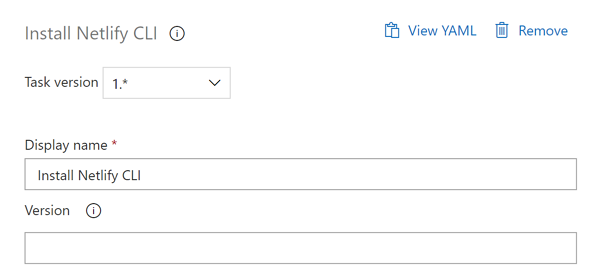
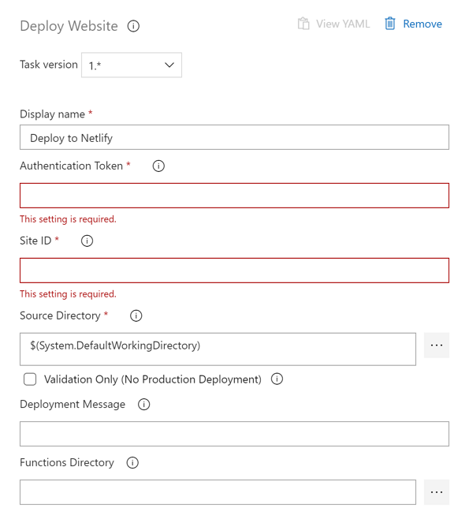

Deploy your static websites to [Netlify](https://netlify.com).

## Acknowledgement ##

This extension currently supports two tasks:

* Install netlify-cli
* Deploy static website to Netlify

## Tasks ##

### Install Netlify CLI ###

This task installs the [netlify-cli](https://www.npmjs.com/package/netlify-cli) npm package to the agent.

* `Version`: Specify the netlify-cli version. If omitted, the latest version of netlify-cli will be installed. Any specific version can be found at the [npmjs.com](https://www.npmjs.com/package/netlify-cli) page.

### Deploy to Netlify ###

This task deploys the static website artifact to [Netlify](https://netlify.com).

* `Authentication Token`: **(Required)** Personal Access Token (PAT) of your Netlify account.
* `Site ID`: **(Required)** Your Netlify site ID.
* `Source Directory`: **(Required)** Your static website artifact directory. Default is `$(System.DefaultWorkingDirectory)`.
* `Validation Only`: **(Optional)** If checked, the task only validates the deployment.
* `Deployment Message`: **(Optional)** Short blurb for deployment log.
* `Functions Directory`: **(Optional)** AWS Lambda functions directory.

---

> The logo used here belongs to [Netlify](https://www.netlify.com/press/).
